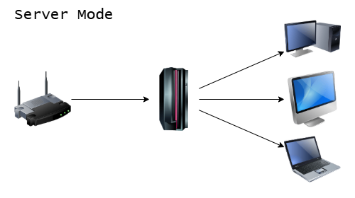
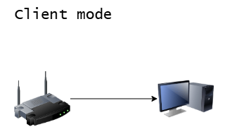

# Magic Packet API

## Authors

- Nikita Somenkov (original author)
- Victor Carreon (co-author, (new routes and performance improvements))

---

### Diference between server and client

#### Server Mode: Centralized Management

Server Mode: Centralized Management
Use Server Mode if you want to manage your entire network through a single exposed device. This is the most secure and simplest method, as you only need to configure one entry point (IP/Port) for external access. The server then handles all power commands for the other devices within your local network.



#### Client Mode: Individual Control

Install Client Mode on devices that need to be managed. You have two ways to use it:

- **Standard**: Let the Server manage the device (no extra setup required).

- **Direct Access**: Configure individual port forwarding for each client to expose their specific IPs. This allows you to manage each device independently without relying on a central server.

**Note**: Regardless of the mode, ensure the program is installed and firewall exceptions are added on every device.



---

#### Common info methods:

##### Server Methods

Set up server for managing internal devices

- Enable this if you dont neccesary want to expose ip address of internal devices

- **Method**: `POST`
- **Request:** `control/server/setup`
- **Updated in:** `1.1.2`
- **Input:**

```json
{
  "api_key": ""
}
```

If not provided it generates a **random** apikey

- **Return:**

```json
{
  "status": true,
  "api_key": "",
  "message": "Server setup completed successfully. Please store the API key securely and restart service or device."
}
```

---

Store device info, for future retrieve and WoL management

**_This route must have header Authorization_**

- **Method**: `POST`
- **Request:** `control/device/configure`
- **Updated in:** `1.1.2`
- **Input:**

```json
{
  "ip": "192.168.0.0",
  "mac": "00:00:00:00:00:00"
}
```

- **Return:**

```json
{
  "status": true,
  "message": "Device configuration stored successfully."
}
```

---

List stored devices

**_This route must have header Authorization_**

- **Method**: `GET`
- **Request:** `control/device/list`
- **Updated in:** `1.1.2`
- **Return:**

```json
{
  "devices": [
    {
      "config": {},
      "ip": "192.168.0.0",
      "mac": "00-00-00-00-00-00"
    }
  ],
  "status": true
}
```

---

Wakes external devices with WoL package

**_This route must have header Authorization_**

- **Method**: `POST`
- **Request:** `control/device/wake`
- **Updated in:** `1.1.2`
- **Input:**

```json
{
  "mac": "00-00-00-00-00-00"
}
```

- **Return:**

```json
{
  "status": true,
  "message": "Wake-on-LAN packet sent to {mac}."
}
```

---

Sleeps an external device with a POST request to the device IP

**_This route must have header Authorization_**

- **Method**: `POST`
- **Request:** `control/device/sleep`
- **Updated in:** `1.1.2`
- **Input:**

```json
{
  "ip": ""
}
```

- **Return:**

```json
{
  "message": "Sleep command sent to {ip}",
  "status": true
}
```

---

Shutdown an external device with a POST request to the device IP

**_This route must have header Authorization_**

- **Method**: `POST`
- **Request:** `control/device/shutdown`
- **Updated in:** `1.1.2`
- **Input:**

```json
{
  "ip": ""
}
```

- **Return:**

```json
{
  "status": true,
  "message": "Shutdown command sent to {ip}."
}
```

---

Reboot an external device with a POST request to the device IP

**_This route must have header Authorization_**

- **Method**: `POST`
- **Request:** `control/device/reboot`
- **Updated in:** `1.1.2`
- **Input:**

```json
{
  "ip": ""
}
```

- **Return:**

```json
{
  "status": true,
  "message": "Reboot command sent to {ip}."
}
```

##### Client Methods

---

Check version of backend

- **Method**: `GET`
- **Request:** `info/version`
- **Modified in:** `1.1.1`
- **Return:**

```json
{
  "mode_server": true,
  "version": "1.1.1"
}
```

---

Check status of PC

- **Method**: `GET`
- **Request:** `info/status`
- **Modified in:** `1.1.1`
- **Return:**

```json
{
  "children": [
    {
      "ip": "192.168.0.0",
      "status": false
    }
  ],
  "status": true
}
```

#### Controlling power of PC methods:

---

Shutdown PC request

- **Method**: `POST`
- **Request:** `control/shutdown`
- **Modified in:** `1.1.1`
- **Input:**

```json
{
  "timeout": 42
}
```

- **Return:**

```json
{
  "status": true,
  "error": "Some error in error case"
}
```

Or

```json
{
  "message": "Server shutdown is not allowed.",
  "status": false
}
```

---

Reboot PC request

- **Method**: `POST`
- **Request:** `control/reboot`
- **Modified in:** `1.1.1`
- **Input:**

```json
{
  "timeout": 42
}
```

- **Return:**

```json
{
  "status": true,
  "error": "Some error in error case"
}
```

Or

```json
{
  "message": "Server reboot is not allowed.",
  "status": false
}
```

---

Sleep PC request

- **Method**: `POST`
- **Request:** `control/sleep`
- **Modified in:** `1.1.1`
- **Input:**

```json
{
  "timeout": 42
}
```

- **Return:**

```json
{
  "status": true,
  "error": "Some error in error case"
}
```

Or

```json
{
  "message": "Server sleep is not allowed.",
  "status": false
}
```

#### Remote devices control methods:

---

Shutdown request

- **Method**: `POST`
- **Request:** `control/device/shutdown`
- **Added in:** `1.1.1`
- **Input:**

```json
{
  "ip": "192.168.0.0"
}
```

- **Return:**

```json
{
  "status": false,
  "error": "Some error in error case"
}
```

Or

```json
{
  "status": true,
  "message": "Shutdown command sent to {ip}."
}
```

---

Reboot request

- **Method**: `POST`
- **Request:** `control/device/reboot`
- **Added in:** `1.1.1`
- **Input:**

```json
{
  "ip": "192.168.0.0"
}
```

- **Return:**

```json
{
  "status": false,
  "error": "Some error in error case"
}
```

Or

```json
{
  "status": true,
  "message": "Reboot command sent to {ip}."
}
```

---

Sleep request

- **Method**: `POST`
- **Request:** `control/device/sleep`
- **Added in:** `1.1.1`
- **Input:**

```json
{
  "ip": "192.168.0.0"
}
```

- **Return:**

```json
{
  "status": false,
  "error": "Some error in error case"
}
```

Or

```json
{
  "status": true,
  "message": "Sleep command sent to {ip}."
}
```
